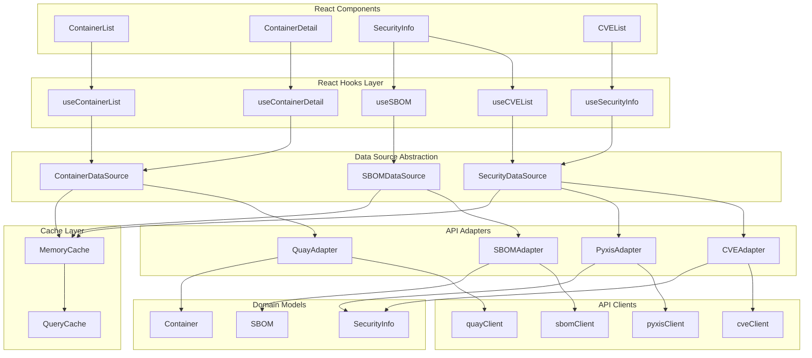
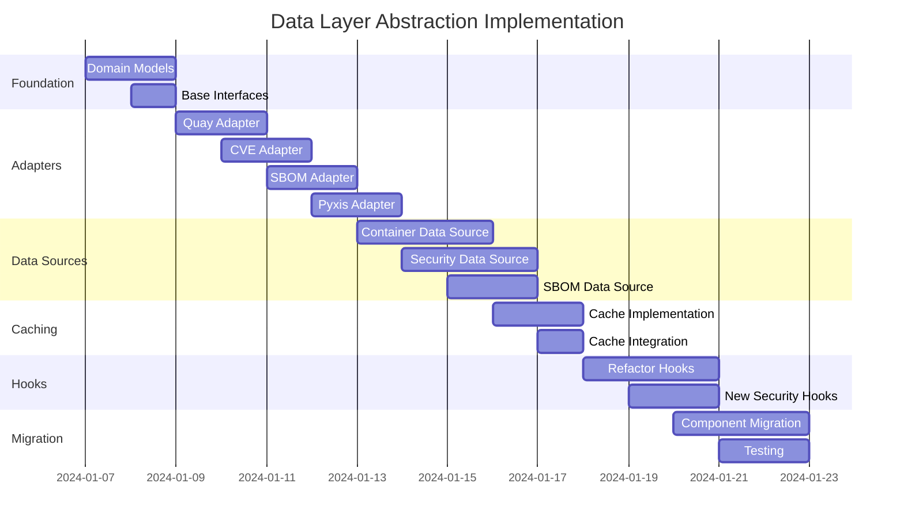

# Data Layer Abstraction Roadmap
## Clean, Concise Data Source Architecture

## Overview

This roadmap outlines the design and implementation of a clean, abstracted data layer that provides a unified interface for interacting with multiple APIs (Quay.io, CVE scanning, SBOM, Pyxis) while maintaining separation of concerns and enabling easy testing, mocking, and future API additions.

## Current State Analysis

### Existing Implementation

**API Clients:**
- `quayClient.ts` - Quay.io API (most complete, handles mock data)
- `cveClient.ts` - CVE scanning API (stub implementation)
- `sbomClient.ts` - SBOM fetching (stub implementation)
- `pyxisClient.ts` - Pyxis integration (not yet implemented)

**React Hooks:**
- `useContainers.ts` - Fetches container list (directly uses quayClient)
- `useContainer.ts` - Fetches single container (directly uses quayClient)

**Types:**
- Domain types: `ContainerImage`, `CVE`, `SecurityInfo` (in `lib/types/`)
- API-specific types: `QuayRepository`, `QuayTag` (in clients)

### Current Issues

1. **Tight Coupling**: Hooks directly depend on API clients
2. **Mixed Concerns**: API-specific types mixed with domain types
3. **No Abstraction**: Components must know about Quay.io structure
4. **Inconsistent Error Handling**: Each client handles errors differently
5. **Scattered Mock Data**: Mock data logic duplicated across clients
6. **No Caching**: Every request hits the API
7. **Hard to Test**: Difficult to mock data sources
8. **No Data Transformation**: API responses used directly in components

### Goals

1. **Unified Interface**: Single API for all data operations
2. **Domain Models**: Normalized types independent of API structure
3. **Easy Testing**: Mockable data sources
4. **Caching**: Reduce API calls and improve performance
5. **Error Handling**: Consistent error patterns
6. **Type Safety**: Full TypeScript support
7. **Extensibility**: Easy to add new APIs

---

## Proposed Architecture

### Architecture Diagram



### Layer Responsibilities

1. **Domain Models**: Normalized, API-agnostic types
2. **API Clients**: Raw HTTP requests to external APIs
3. **Adapters**: Transform API responses to domain models
4. **Data Sources**: Business logic, orchestration, caching
5. **React Hooks**: React-specific data fetching with state management
6. **Components**: UI that consumes hooks

---

## Directory Structure

```
src/lib/data/
├── domain/                    # Domain models (normalized types)
│   ├── Container.ts          # Container, Tag, Variant, Compatibility
│   ├── Security.ts            # CVE, SecurityInfo, CVEBreakdown
│   ├── SBOM.ts                # SBOM, Package, Attestation
│   ├── Metadata.ts            # License, Distributor, Upstream
│   └── index.ts
│
├── adapters/                  # API response adapters
│   ├── quayAdapter.ts        # QuayRepository → Container
│   ├── cveAdapter.ts         # CVE API → SecurityInfo
│   ├── sbomAdapter.ts        # SBOM API → SBOM
│   ├── pyxisAdapter.ts       # Pyxis → SecurityInfo
│   ├── Adapter.ts            # Base adapter interface
│   └── index.ts
│
├── clients/                   # Raw API clients (keep existing)
│   ├── quayClient.ts         # Quay.io API
│   ├── cveClient.ts          # CVE scanning API
│   ├── sbomClient.ts         # SBOM API
│   ├── pyxisClient.ts        # Pyxis API
│   ├── mockData.ts           # Centralized mock data
│   └── index.ts
│
├── sources/                   # Data source abstraction
│   ├── DataSource.ts         # Base interface
│   ├── ContainerDataSource.ts
│   ├── SecurityDataSource.ts
│   ├── SBOMDataSource.ts
│   └── index.ts
│
├── cache/                     # Caching layer
│   ├── Cache.ts              # Cache interface
│   ├── MemoryCache.ts        # In-memory cache implementation
│   ├── CacheKey.ts           # Cache key generation
│   └── index.ts
│
├── hooks/                     # React hooks (use data sources)
│   ├── useContainerList.ts
│   ├── useContainerDetail.ts
│   ├── useCVEList.ts
│   ├── useSBOM.ts
│   ├── useSecurityInfo.ts
│   └── index.ts
│
├── errors/                    # Error handling
│   ├── DataError.ts          # Custom error types
│   ├── ErrorHandler.ts       # Error transformation
│   └── index.ts
│
└── index.ts                   # Public API
```

---

## Implementation Phases

### Phase 1: Foundation & Domain Models

**Priority:** P0 (Critical)

#### 1.1 Domain Model Definitions
**Files:** `src/lib/data/domain/*.ts`

**Tasks:**
- Define normalized `Container` type (combines QuayRepository + additional fields)
- Define `Tag` type (normalized from QuayTag)
- Define `SecurityInfo` type (combines CVE + Pyxis data)
- Define `SBOM` type (normalized SBOM structure)
- Define `Metadata` types (License, Distributor, etc.)
- Ensure types are API-agnostic

**Key Types:**
```typescript
// Container.ts
export interface Container {
  id: string;                    // Unique identifier
  name: string;                  // Image name
  namespace: string;             // Organization/namespace
  description?: string;
  logo?: string;                 // Distributor logo URL
  upstreamLink?: string;         // GitHub/repository link
  license?: License;
  compatibility: CompatibilityData;
  tags: Tag[];
  lastUpdated: Date;
  lastScanned?: Date;
  isPublic: boolean;
  // ... other normalized fields
}

// Security.ts
export interface SecurityInfo {
  containerId: string;
  cveCount: number;
  zeroCVE: boolean;
  cves: CVE[];
  cveBreakdown: CVEBreakdown;
  fipsEnabled?: boolean;
  stigCompliant?: boolean;
  sbomAvailable: boolean;
  totalPackages?: number;
  lastScanned?: Date;
}
```

#### 1.2 Base Interfaces
**Files:** `src/lib/data/sources/DataSource.ts`, `src/lib/data/adapters/Adapter.ts`

**Tasks:**
- Define `DataSource<T>` interface
- Define `Adapter<TInput, TOutput>` interface
- Define error types
- Define cache interface

### Phase 2: Adapter Layer

**Priority:** P0 (Critical)

#### 2.1 Quay Adapter
**File:** `src/lib/data/adapters/quayAdapter.ts`

**Tasks:**
- Transform `QuayRepository` → `Container`
- Transform `QuayTag` → `Tag`
- Handle missing/null fields
- Normalize date formats
- Map API-specific fields to domain fields

**Example:**
```typescript
export const quayAdapter = {
  toContainer: (quayRepo: QuayRepository): Container => ({
    id: `${quayRepo.namespace}/${quayRepo.name}`,
    name: quayRepo.name,
    namespace: quayRepo.namespace,
    description: quayRepo.description,
    isPublic: quayRepo.is_public,
    lastUpdated: new Date(quayRepo.last_modified || Date.now()),
    // ... map other fields
  }),
  
  toTag: (quayTag: QuayTag): Tag => ({
    name: quayTag.name,
    digest: quayTag.manifest_digest,
    size: quayTag.size,
    lastModified: quayTag.last_modified ? new Date(quayTag.last_modified) : undefined,
    isLatest: quayTag.name === 'latest',
    // ... map other fields
  }),
};
```

#### 2.2 CVE Adapter
**File:** `src/lib/data/adapters/cveAdapter.ts`

**Tasks:**
- Transform CVE API response → `SecurityInfo`
- Order CVEs by severity
- Calculate CVE breakdown
- Handle zero CVE case

#### 2.3 SBOM Adapter
**File:** `src/lib/data/adapters/sbomAdapter.ts`

**Tasks:**
- Transform SBOM API response → `SBOM` domain model
- Handle different SBOM formats (SPDX, CycloneDX)
- Extract package information

#### 2.4 Pyxis Adapter
**File:** `src/lib/data/adapters/pyxisAdapter.ts`

**Tasks:**
- Transform Pyxis API response → `SecurityInfo`
- Merge with CVE data
- Extract compliance information (FIPS, STIG)

### Phase 3: Data Source Implementation

**Priority:** P0 (Critical)

#### 3.1 Container Data Source
**File:** `src/lib/data/sources/ContainerDataSource.ts`

**Tasks:**
- Implement `ContainerDataSource` interface
- Orchestrate multiple API calls (Quay + metadata)
- Handle caching
- Error handling and retry logic
- Support search, filter, pagination

**Methods:**
- `listContainers(options)` - List with filters/search
- `getContainer(id)` - Get single container
- `getTags(containerId)` - Get tags for container
- `searchContainers(query)` - Search functionality

#### 3.2 Security Data Source
**File:** `src/lib/data/sources/SecurityDataSource.ts`

**Tasks:**
- Implement `SecurityDataSource` interface
- Orchestrate CVE + Pyxis API calls
- Merge security data from multiple sources
- Cache security scans

**Methods:**
- `getSecurityInfo(containerId, tag?)` - Get complete security info
- `getCVEs(containerId, tag?)` - Get CVE list
- `getComplianceInfo(containerId)` - Get FIPS/STIG info

#### 3.3 SBOM Data Source
**File:** `src/lib/data/sources/SBOMDataSource.ts`

**Tasks:**
- Implement `SBOMDataSource` interface
- Handle SBOM fetching and caching
- Support multiple formats

**Methods:**
- `getSBOM(containerId, tag?, format?)` - Get SBOM
- `getPackages(containerId, tag?)` - Get package list

### Phase 4: Caching Layer

**Priority:** P1 (High)

#### 4.1 Memory Cache Implementation
**File:** `src/lib/data/cache/MemoryCache.ts`

**Tasks:**
- Implement in-memory cache with TTL
- Cache key generation
- Cache invalidation strategies
- Size limits and eviction policies

**Features:**
- Time-based expiration (TTL)
- Size-based eviction (LRU)
- Manual invalidation
- Cache statistics

#### 4.2 Cache Integration
**Tasks:**
- Integrate cache into data sources
- Define cache keys for each data type
- Implement cache warming strategies

### Phase 5: React Hooks Layer

**Priority:** P0 (Critical)

#### 5.1 Container Hooks
**Files:** `src/lib/data/hooks/useContainerList.ts`, `useContainerDetail.ts`

**Tasks:**
- Refactor existing hooks to use data sources
- Add loading states
- Add error states
- Add refetch capabilities
- Support pagination

#### 5.2 Security Hooks
**Files:** `src/lib/data/hooks/useCVEList.ts`, `useSecurityInfo.ts`

**Tasks:**
- Create hooks for security data
- Support real-time updates
- Handle partial data loading

#### 5.3 SBOM Hooks
**File:** `src/lib/data/hooks/useSBOM.ts`

**Tasks:**
- Create hook for SBOM data
- Support format selection
- Handle large SBOM files

### Phase 6: Error Handling & Mock Data

**Priority:** P1 (High)

#### 6.1 Error Handling
**Files:** `src/lib/data/errors/*.ts`

**Tasks:**
- Define custom error types
- Create error handler
- Transform API errors to user-friendly messages
- Logging and error reporting

#### 6.2 Centralized Mock Data
**File:** `src/lib/data/clients/mockData.ts`

**Tasks:**
- Consolidate all mock data
- Create mock data generators
- Support development mode
- Environment-based mock switching

### Phase 7: Migration & Testing

**Priority:** P1 (High)

#### 7.1 Migration Strategy
**Tasks:**
- Migrate existing components to new hooks
- Update type imports
- Remove direct API client usage from components
- Gradual migration path

#### 7.2 Testing
**Tasks:**
- Unit tests for adapters
- Unit tests for data sources
- Integration tests for hooks
- Mock data source for testing

---

## Detailed Component Specifications

### Domain Models

#### Container Domain Model

```typescript
// domain/Container.ts
export interface Container {
  // Identity
  id: string;                    // "namespace/name"
  name: string;
  namespace: string;
  
  // Display
  description?: string;
  logo?: string;                // Distributor logo URL
  upstreamLink?: string;        // GitHub/repository
  
  // Metadata
  license?: License;
  compatibility: CompatibilityData;
  
  // Lifecycle
  tags: Tag[];
  lastUpdated: Date;
  lastScanned?: Date;
  
  // Status
  isPublic: boolean;
  pullCount?: number;
  starCount?: number;
  
  // Hummingbird-specific
  isHummingbird?: boolean;
  variants?: Variant[];
  sbomAvailable?: boolean;
  attestationsAvailable?: boolean;
}

export interface Tag {
  name: string;
  digest?: string;
  size?: number;
  lastModified?: Date;
  isLatest?: boolean;
  variant?: 'default' | 'builder';
  securityScanStatus?: 'pending' | 'completed' | 'failed';
}

export interface Variant {
  type: 'default' | 'builder';
  tag: string;
  hasPackageManager: boolean;
  hasShell: boolean;
  description: string;
  size?: number;
}

export interface CompatibilityData {
  architectures: string[];
  platforms?: string[];
  openshiftCompatible?: boolean;
  openshiftVersions?: string[];
}
```

#### Security Domain Model

```typescript
// domain/Security.ts
export interface SecurityInfo {
  containerId: string;
  tag?: string;
  
  // CVE Information
  cveCount: number;
  zeroCVE: boolean;
  cves: CVE[];
  cveBreakdown: CVEBreakdown;
  
  // Compliance
  fipsEnabled?: boolean;
  stigCompliant?: boolean;
  
  // SBOM
  sbomAvailable: boolean;
  totalPackages?: number;
  
  // Metadata
  lastScanned?: Date;
  scanStatus?: 'pending' | 'completed' | 'failed';
}

export interface CVE {
  id: string;                    // "CVE-2024-1234"
  severity: 'critical' | 'high' | 'medium' | 'low';
  cvssScore?: number;
  description: string;
  affectedPackages?: string[];
  remediation?: string;
  fixedInVersions?: string[];
  publishedDate?: Date;
  lastModified?: Date;
}

export interface CVEBreakdown {
  critical: number;
  high: number;
  medium: number;
  low: number;
}
```

### Data Source Interface

```typescript
// sources/DataSource.ts
export interface DataSource<T> {
  get(id: string, options?: any): Promise<T>;
  list(options?: any): Promise<T[]>;
  search(query: string, options?: any): Promise<T[]>;
  invalidateCache?(id?: string): void;
}

export interface ContainerDataSource extends DataSource<Container> {
  getContainer(id: string): Promise<Container>;
  listContainers(options: ListContainersOptions): Promise<ContainerListResult>;
  searchContainers(query: string, options?: SearchOptions): Promise<Container[]>;
  getTags(containerId: string): Promise<Tag[]>;
}

export interface SecurityDataSource {
  getSecurityInfo(containerId: string, tag?: string): Promise<SecurityInfo>;
  getCVEs(containerId: string, tag?: string): Promise<CVE[]>;
  getComplianceInfo(containerId: string): Promise<ComplianceInfo>;
}
```

### Adapter Pattern

```typescript
// adapters/Adapter.ts
export interface Adapter<TInput, TOutput> {
  transform(input: TInput): TOutput;
  transformMany?(inputs: TInput[]): TOutput[];
  canTransform(input: unknown): input is TInput;
}
```

### Cache Interface

```typescript
// cache/Cache.ts
export interface Cache<T> {
  get(key: string): T | null;
  set(key: string, value: T, ttl?: number): void;
  delete(key: string): void;
  clear(): void;
  has(key: string): boolean;
}
```

---

## Implementation Timeline



---

## Migration Strategy

### Step 1: Parallel Implementation
- Build new data layer alongside existing code
- Keep existing hooks working
- No breaking changes initially

### Step 2: Gradual Migration
- Migrate one component at a time
- Update imports to use new hooks
- Remove direct API client usage

### Step 3: Cleanup
- Remove old hook implementations
- Consolidate types
- Update documentation

### Migration Checklist

- [ ] Domain models defined
- [ ] Adapters implemented
- [ ] Data sources implemented
- [ ] Cache layer integrated
- [ ] Hooks refactored
- [ ] Components migrated
- [ ] Tests written
- [ ] Documentation updated
- [ ] Old code removed

---

## Success Criteria

### Functional Requirements
- [ ] All API interactions go through data sources
- [ ] Components use domain models, not API types
- [ ] Caching reduces API calls by 50%+
- [ ] Error handling is consistent across all data operations
- [ ] Mock data works seamlessly in development
- [ ] New APIs can be added without changing components

### Technical Requirements
- [ ] Full TypeScript type safety
- [ ] Zero direct API client usage in components
- [ ] All data sources are testable with mocks
- [ ] Cache invalidation works correctly
- [ ] Performance meets benchmarks

### Developer Experience
- [ ] Easy to add new data sources
- [ ] Clear separation of concerns
- [ ] Well-documented APIs
- [ ] Consistent patterns across codebase

---

## Benefits

### For Developers
- **Clean API**: Single interface for all data operations
- **Type Safety**: Domain models prevent API coupling
- **Testability**: Easy to mock data sources
- **Maintainability**: Changes to APIs don't affect components

### For Application
- **Performance**: Caching reduces API calls
- **Reliability**: Consistent error handling
- **Flexibility**: Easy to swap APIs or add new sources
- **User Experience**: Faster load times, better error messages

### For Future
- **Extensibility**: Easy to add new APIs (Docker Hub, etc.)
- **Scalability**: Cache layer can be upgraded to Redis
- **Testing**: Mock data sources for E2E tests
- **Analytics**: Centralized logging and monitoring

---

## Key Decisions

### 1. Adapter Pattern
**Decision**: Use adapter pattern to transform API responses
**Rationale**: Keeps domain models clean, allows multiple API sources

### 2. Data Source Abstraction
**Decision**: Abstract data operations behind interfaces
**Rationale**: Enables testing, caching, and future API additions

### 3. Caching Strategy
**Decision**: In-memory cache with TTL
**Rationale**: Simple, effective, can upgrade to Redis later

### 4. Hook-Based API
**Decision**: React hooks as primary interface for components
**Rationale**: Familiar pattern, good for React apps

### 5. Gradual Migration
**Decision**: Build alongside existing code, migrate gradually
**Rationale**: Reduces risk, allows testing, no big-bang changes

---

## Next Steps

1. **Review & Approve Architecture** (This document)
2. **Start Phase 1**: Domain model definitions
3. **Implement Adapters**: Transform API responses
4. **Build Data Sources**: Business logic layer
5. **Add Caching**: Performance optimization
6. **Refactor Hooks**: Update React hooks
7. **Migrate Components**: Update to use new hooks
8. **Testing & Documentation**: Ensure quality

---

**Document Version:** 1.0  
**Last Updated:** January 2025  
**Status:** Ready for Implementation

