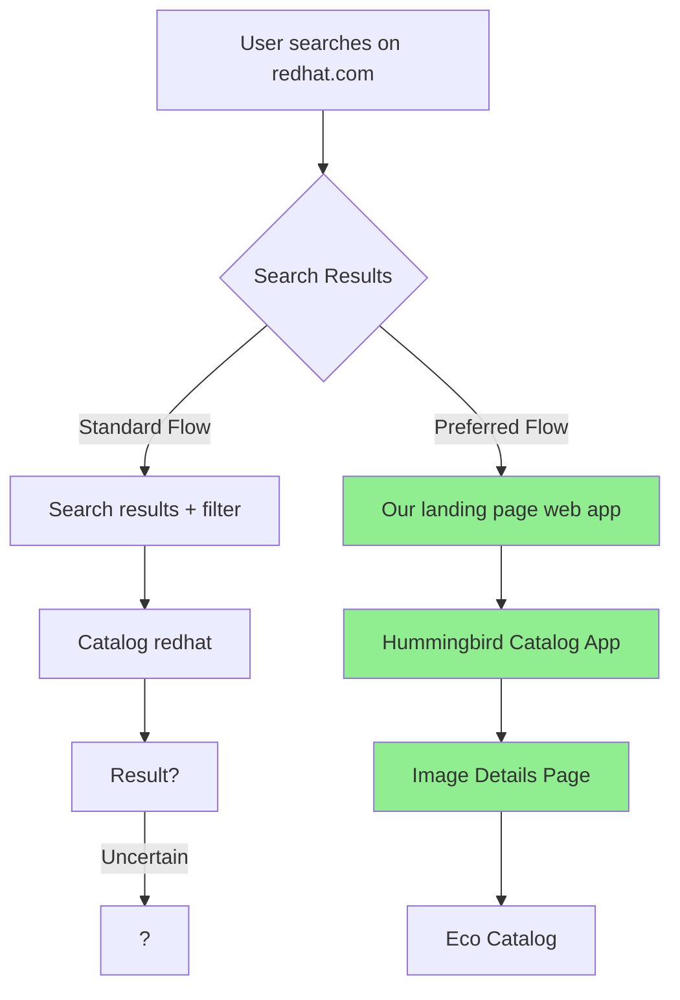
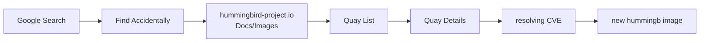
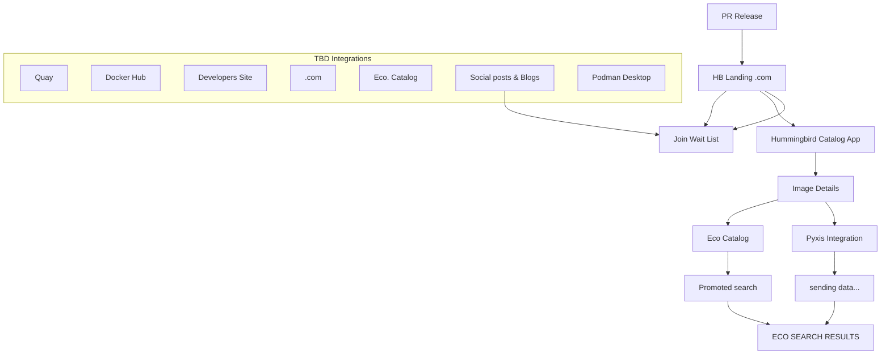
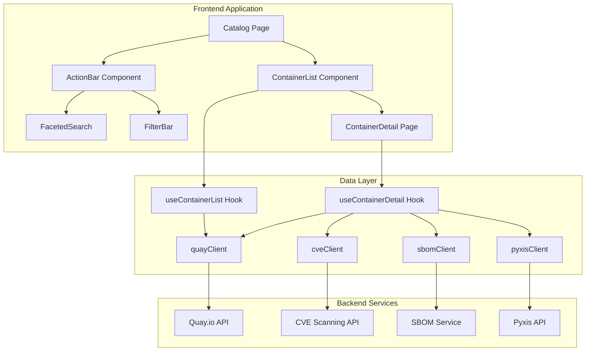
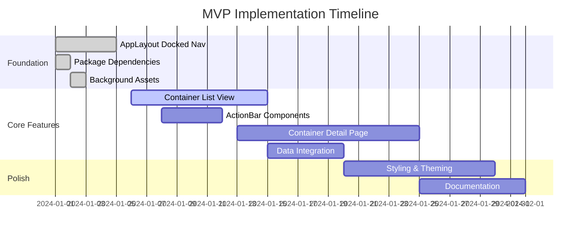

# Hummingbird Compass Application Roadmap
## Comprehensive Feature Specification & Implementation Plan

## Overview

This roadmap synthesizes requirements from multiple sources:
- PatternFly Compass demos from [pf-react-staging.patternfly.org](https://pf-react-staging.patternfly.org/ai/generative-uis/compass/react-demos#docked-nav-demo)
- Project whiteboard specifications (MUST HAVE, NICE TO HAVE, INNOVATION features)
- Existing STRUCTURE.md component requirements
- User flow diagrams and UI/UX design requirements

## Current Implementation Status

### ✅ Completed (Phase 1)
- AppLayout updated to match docked nav demo
- React Router integration
- Icon-based navigation with tooltips
- Settings and Help buttons
- User dropdown menu
- Background images configured
- All pages use CompassMainHeader

### 🟡 In Progress (Phase 2)
- Middle navigation structure in place
- Pages updated with CompassMainHeader

### ⏳ Pending
- Container registry functionality
- Whiteboard feature integration
- Advanced UI components

---

## Feature Specification (Synthesized from Whiteboards)

### MUST HAVE Features (Core MVP)

#### Category 1: Image Information
**Display Requirements:**
- Container image name (prominent title)
- Distributor logo (visual branding)
- Docker pull command (copyable)
- Podman pull command (copyable)
- Compatibility information (platforms, architectures)
- License information (display and link)
- Upstream connectivity link (GitHub/repository)

**Implementation Notes:**
- Pull commands should be in code blocks with copy button
- Logo should link to distributor site
- Compatibility should show icons/badges for supported platforms

#### Category 2: Minimal Information
**Display Requirements:**
- Image download size (human-readable format)
- Containerfile (viewer with syntax highlighting)
- Architecture information (amd64, arm64, etc.)
- Image comparison report (GitLab integration)
- Drop-in replacement guide for `default:latest`

**Implementation Notes:**
- Containerfile viewer should support expand/collapse
- Comparison report should link to GitLab CI/CD results
- Drop-in guide should be step-by-step instructions

#### Category 3: Updated Information
**Display Requirements:**
- Date & time of last update (relative and absolute)
- Tags listing (all available tags)
- `:latest` tag indicator (special highlighting)
- Build indicators:
  - Package manager presence
  - Shell availability
- `:latest-builder` tag
- Default image references (e.g., `go:latest`)
- Security feed integration
- Date & time of last scan

**Implementation Notes:**
- Tags should be searchable/filterable
- Special tags (`:latest`, `:latest-builder`) should have badges
- Build indicators should use icons

#### Category 4: Secure Information
**Display Requirements:**
- Zero CVEs indicator (when no vulnerabilities)
- CVE list ordered by severity:
  - Critical (highest priority)
  - High
  - Medium
  - Low
- In-page SBOM viewer (expandable)
- Cosign instructions (verification steps)
- FIPS compliance indicator (icon/label when applicable)
- STIG compliance indicator
- Total CVE count per image
- Total package count in SBOM

**Implementation Notes:**
- CVE list should be filterable by severity
- SBOM viewer should support multiple formats
- Compliance indicators should be prominent badges

### NICE TO HAVE Features (Enhancements)

#### Image Management
- Version number tracking/record
- Request an image feature (form submission)
- FIPS availability on other versions (cross-reference)
- Shareable URLs for every tag (deep linking)
- Dual logo support (distributor + RH/HB branding)
- Copy & pasteable pull commands (enhanced UX)

#### Platform Integration
- Compatibility cross-sell for RH platforms
- "Use with OpenShift" guidance/links
- Project Compass design system integration

#### Search & Discovery
- Intelligent advisory catalog/search (AI-powered)
- Documentation-trained search
- Chat-driven interface (CompassMessageBar integration)

#### Security Enhancements
- Download SPDX SBOM format (export functionality)
- Multiple attestation types (display and verify)
- Advisories (CVE resolution history)
- Link to official CVE repository
- Manifest digest display

#### User Experience
- Clear onboarding & usage instructions
- Common errors guide (troubleshooting)

### INNOVATION Features (Future)

- Sharing beyond copy + paste (social sharing, embed codes)
- Recently searched history (persistent user preferences)
- Image customization capabilities (build configuration)

---

## UI/UX Design Requirements

### Search Results List Component

**Layout Structure:**
```
┌─────────────────────────────────────────────────────────┐
│ [Logo]  Title                              [Add to Fav] │
│          Distributor/Provider                            │
│          Shorter description                            │
│          [Icon] Category 'Containerized Application'    │
│          [Icon] Category 'Storage'                      │
│          Time Published (x minutes ago)                 │
└─────────────────────────────────────────────────────────┘
```

**Requirements:**
- Clickable cards linking to detail page
- Distributor logo (top-left)
- Title (prominent)
- Short description (truncated with expand)
- Category icons/tags
- Add to favorites button
- Distributor/Provider name
- Relative time published
- Filter options (category, distributor, etc.)

### Card Component (Catalog View)

**Layout Structure:**
```
┌─────────────────────────────────────────────────────────┐
│ [Icon]  TITLE                                           │
│          Distributor / Provider                         │
│          DESCRIPTION                                    │
│          ┌──────────────┐  ┌──────────────────────┐   │
│          │view          │  │view Container Image   │   │
│          │documentation │  │                      │   │
│          └──────────────┘  └──────────────────────┘   │
│          [Icon] Category MCP server                    │
│          [Icon] Category "AI"                          │
│          github repo of distributor                    │
│          Quay                                           │
└─────────────────────────────────────────────────────────┘
```

**Requirements:**
- Icon/logo (visual identifier)
- Title (container name)
- Distributor/Provider (metadata)
- Description (truncated)
- Action links (documentation, container image)
- Category tags with icons
- External links (GitHub, Quay)

### Detail Page Layout

**Structure:**
```
┌─────────────────────────────────────────────────────────┐
│ > > > Breadcrumb                                        │
│                                                          │
│ Title                                                    │
│ Desc. repository → github (RH)                          │
│ [CTA Button]                    [Image Placeholder]     │
│                                                          │
│ ─────────────────────────────────────────────────────── │
│ 🔍 Search by name                   1-20 of XX         │
│                                                          │
│ ┌──────┐ ┌──────┐ ┌──────┐ ┌──────┐                   │
│ │ Card │ │ Card │ │ Card │ │ Card │                   │
│ └──────┘ └──────┘ └──────┘ └──────┘                   │
└─────────────────────────────────────────────────────────┘
```

**Requirements:**
- Breadcrumb navigation
- Title and description
- Repository link
- CTA button (primary action)
- Image/graphic placeholder
- Search functionality
- Card grid with pagination

---

## User Flow Diagrams

### Primary User Journey



### Discovery Flow



### Application Flow



### Data Flow Architecture



---

## Updated Implementation Phases

### Phase 1: Foundation & Layout Alignment ✅

**Status:** Complete

- ✅ AppLayout with docked navigation
- ✅ React Router integration
- ✅ Icon-based navigation
- ✅ Settings/Help buttons
- ✅ User menu
- ✅ Background images

### Phase 2: Compass Layout Features 🟡

**Status:** In Progress

#### 2.1 Middle Navigation in Header
- **Priority:** High
- **Components:** Tabs, TabContent, TabTitleText
- **Integration:** CompassMainHeader toolbar prop
- **Pages:** Catalog, Settings (with sub-tabs)

#### 2.2 Vertical Sidebars with ActionList
- **Priority:** Medium
- **Components:** ActionList, ActionListGroup, Button (isCircle)
- **Use Cases:** Detail page actions, quick filters

#### 2.3 Hero Component
- **Priority:** Medium
- **Location:** Dashboard, Landing page
- **Features:** Custom gradient, dark mode support

#### 2.4 Footer with CompassMessageBar
- **Priority:** Low
- **Features:** AI text input, global footer

### Phase 3: Container Registry Core Features ⏳

**Status:** Pending

#### 3.1 Container List View (Catalog Page)

**MUST HAVE Components:**

1. **Search Results List**
   - File: `src/app/Catalog/ContainerList/ContainerList.tsx`
   - Features:
     - Clickable cards
     - Distributor logo
     - Container name (title)
     - Short description
     - Category tags
     - Add to favorites
     - Time published
   - Variants: Grid, Table, List

2. **ActionBar Component**
   - File: `src/components/ActionBar/ActionBar.tsx`
   - Sub-components:
     - `FacetedSearch.tsx` - Expandable search input
     - `FilterBar.tsx` - Filter management
     - `Labels.tsx` - Active filter labels
     - `Actions.tsx` - Action buttons

3. **Search & Filter**
   - Search by name functionality
   - Category filters
   - Distributor filters
   - Tag filters
   - Pagination (1-20 of XX)

**Implementation Tasks:**
- Create ContainerList component with card variant
- Implement ActionBar with all sub-components
- Add search functionality
- Implement filtering system
- Add pagination
- Create route: `/catalog`

#### 3.2 Container Detail Page

**MUST HAVE Sections:**

1. **Header Section**
   - File: `src/components/ContainerDetail/ContainerDetailHeader.tsx`
   - Components:
     - Breadcrumb navigation
     - Container image name (Title)
     - Description
     - Repository link (GitHub/upstream)
     - CTA button
     - Distributor logo

2. **Image Information Section**
   - File: `src/components/ContainerDetail/PullCommandDisplay.tsx`
   - Features:
     - Docker pull command (copyable)
     - Podman pull command (copyable)
     - Compatibility information
     - License display
     - Upstream connectivity link

3. **Minimal Information Section**
   - File: `src/components/ContainerDetail/MinimalInfo.tsx`
   - Features:
     - Image download size
     - Containerfile viewer
     - Architecture information
     - Image comparison report (GitLab link)
     - Drop-in replacement guide

4. **Updated Information Section**
   - File: `src/components/ContainerDetail/UpdateInfo.tsx`
   - Features:
     - Date & time of last update
     - Tags listing (TagList component)
     - `:latest` tag indicator
     - Build indicators (package manager, shell)
     - `:latest-builder` tag
     - Default image references
     - Security feed
     - Date & time of last scan

5. **Secure Information Section**
   - File: `src/components/ContainerDetail/SecurityInfo.tsx`
   - Sub-components:
     - `CVEList.tsx` - CVE display (ordered by severity)
     - `SBOMViewer.tsx` - In-page SBOM viewer
     - Cosign instructions
     - FIPS compliance indicator
     - STIG compliance indicator
     - Total CVE count
     - Total package count

**Implementation Tasks:**
- Create ContainerDetail page component
- Implement all section components
- Add CVE severity ordering
- Implement SBOM viewer
- Add compliance indicators
- Create route: `/catalog/:imageName`

#### 3.3 Data Integration Layer

**API Clients:**
- File: `src/lib/data/clients/quayClient.ts` - Quay.io API
- File: `src/lib/data/clients/cveClient.ts` - CVE scanning API
- File: `src/lib/data/clients/sbomClient.ts` - SBOM fetching (cosign)
- File: `src/lib/data/clients/pyxisClient.ts` - Pyxis integration (MUST HAVE)

**Data Hooks:**
- `useContainerList.ts` - Fetch container list
- `useContainerDetail.ts` - Fetch container details
- `useCVEList.ts` - Fetch CVEs
- `useSBOM.ts` - Fetch SBOM data

**Context Providers:**
- `AppDataContext.tsx` - Centralized app data
- `FilterContext.tsx` - Filter state management

### Phase 4: NICE TO HAVE Features ⏳

**Status:** Pending (Post-MVP)

#### 4.1 Image Management Enhancements
- Version tracking system
- Request image feature
- Shareable URLs per tag
- Dual logo support
- Enhanced copy/paste UX

#### 4.2 Platform Integration
- OpenShift integration
- RH platform cross-sell
- Compass design system alignment

#### 4.3 Search Enhancements
- Intelligent search (AI-powered)
- Documentation-trained search
- Chat-driven interface

#### 4.4 Security Enhancements
- SPDX SBOM download
- Multiple attestation types
- CVE resolution history
- Official CVE repository links
- Manifest digest display

#### 4.5 User Experience
- Onboarding instructions
- Common errors guide

### Phase 5: INNOVATION Features ⏳

**Status:** Future

- Advanced sharing mechanisms
- Search history
- Image customization

### Phase 6: Architecture & Polish ⏳

#### 6.1 Component Reorganization
- Concern-based architecture
- Variant-based presentation
- Composable structure

#### 6.2 Configuration System
- Centralized app config
- Filter definitions (JSON)
- Action definitions per context

#### 6.3 Styling & Theming
- Glass-morphism effects
- Dark/light mode polish
- Responsive design
- Animation polish

#### 6.4 Documentation
- README updates
- Component documentation
- Usage examples
- AI documentation updates

---

## Component Architecture

### Directory Structure

```
src/
├── app/
│   ├── AppLayout/
│   │   └── AppLayout.tsx          ✅ Complete
│   ├── Catalog/
│   │   ├── Catalog.tsx            ⏳ To be created
│   │   └── ContainerList/
│   │       ├── ContainerList.tsx
│   │       ├── ContainerListCard.tsx
│   │       └── ContainerListTable.tsx
│   ├── ContainerDetail/
│   │   └── ContainerDetail.tsx    ⏳ To be created
│   └── routes.tsx
│
├── components/
│   ├── ActionBar/
│   │   ├── ActionBar.tsx
│   │   ├── FacetedSearch.tsx
│   │   ├── FilterBar.tsx
│   │   ├── Labels.tsx
│   │   └── Actions.tsx
│   └── ContainerDetail/
│       ├── ContainerDetailHeader.tsx
│       ├── PullCommandDisplay.tsx
│       ├── CompatibilityInfo.tsx
│       ├── LicenseDisplay.tsx
│       ├── MinimalInfo.tsx
│       ├── UpdateInfo.tsx
│       ├── SecurityInfo.tsx
│       ├── CVEList.tsx
│       ├── SBOMViewer.tsx
│       ├── VariantInfo.tsx
│       ├── TagList.tsx
│       ├── ContainerfileViewer.tsx
│       └── DropInReplaceGuide.tsx
│
└── lib/
    ├── data/
    │   └── clients/
    │       ├── quayClient.ts
    │       ├── cveClient.ts
    │       ├── sbomClient.ts
    │       └── pyxisClient.ts
    ├── types/
    │   ├── container.ts
    │   ├── cve.ts
    │   └── metadata.ts
    └── config/
        ├── filters.json
        └── actions.json
```

---

## Implementation Priority Matrix

### Critical Path (MVP)



### Priority Breakdown

**P0 (Critical - Blocking MVP):**
1. Container List View with search/filter
2. Container Detail Page (core sections)
3. Pyxis integration for security data
4. Basic data fetching (Quay.io)

**P1 (High - Important for MVP):**
1. CVE display (ordered by severity)
2. SBOM viewer (in-page)
3. Pull commands (copyable)
4. Tag listing

**P2 (Medium - Enhancements):**
1. Middle navigation tabs
2. Vertical sidebars
3. Hero component
4. Advanced filtering

**P3 (Low - Post-MVP):**
1. Footer with CompassMessageBar
2. NICE TO HAVE features
3. INNOVATION features

---

## Success Criteria

### MVP Success Criteria

- [ ] Users can search and filter container images
- [ ] Container detail page displays all MUST HAVE information
- [ ] CVEs are displayed and ordered by severity
- [ ] SBOM is viewable in-page
- [ ] Pull commands are copyable
- [ ] Pyxis integration provides security data
- [ ] Responsive design works on mobile/tablet/desktop
- [ ] Dark/light mode functions correctly
- [ ] Navigation is intuitive and matches Compass patterns

### Full Feature Success Criteria

- [ ] All MUST HAVE features implemented
- [ ] All NICE TO HAVE features implemented
- [ ] Search results match whiteboard design
- [ ] Card components match specifications
- [ ] Detail page layout matches requirements
- [ ] User flows are smooth and intuitive
- [ ] Performance meets benchmarks
- [ ] Accessibility standards met
- [ ] Documentation is complete

---

## Key Reference Materials

- **Compass Demos**: https://pf-react-staging.patternfly.org/ai/generative-uis/compass/react-demos
- **Compass Documentation**: https://github.com/patternfly/patternfly-react/blob/main/packages/react-core/src/demos/Compass/Compass.md
- **AI Guidance**: `patternfly-react-seed-legacy/COMPASS-THEME-DOCS-SUMMARY.md`
- **Architecture**: `hummingbird-compass-theme/docs/README.md`
- **Component Requirements**: `patternfly-react-seed-legacy/STRUCTURE.md`
- **Whiteboard Specifications**: Project planning whiteboards (synthesized above)

---

## Next Steps

1. **Immediate (This Week):**
   - Create ContainerList component structure
   - Implement ActionBar with FacetedSearch
   - Set up basic data fetching hooks

2. **Short Term (Next 2 Weeks):**
   - Complete Container Detail Page (core sections)
   - Implement CVE display with severity ordering
   - Add SBOM viewer component
   - Integrate Pyxis API client

3. **Medium Term (Next Month):**
   - Complete all MUST HAVE features
   - Implement NICE TO HAVE enhancements
   - Polish UI/UX based on whiteboard designs
   - Add comprehensive testing

4. **Long Term:**
   - INNOVATION features
   - Advanced search capabilities
   - Full architecture reorganization
   - Performance optimization

---

**Document Version:** 1.0  
**Last Updated:** January 2025  
**Status:** Active Planning

