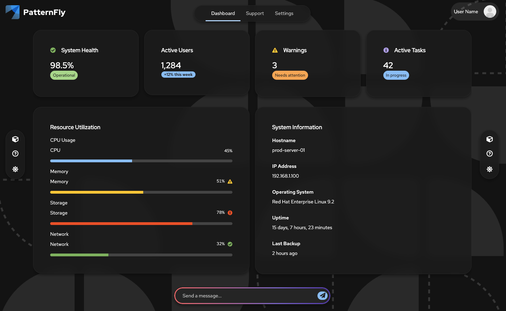

# PatternFly React Seed - Compass Theme Branch

This is the **Compass theme branch** of PatternFly React Seed - a specialized build scaffolding utility designed for creating modern, AI-optimized web applications with PatternFly's new **Compass theme** and **Generative UI** components.

## 🎯 What is This Branch?

The `compass_theme` branch is a **seed/template for building Compass-based UIs** that leverage PatternFly's latest generative UI capabilities, including:

- 🎨 **Glass-morphism effects** and modern visual treatments
- 🤖 **AI-optimized components** with thinking indicators and AI content highlighting
- 📐 **Compass layout components** designed for agentic development
- 🔄 **React Flow integration** for pipelines and topology visualizations
- ✨ **New design tokens** for gradients, animations, and background effects

Out of the box you'll get a Compass-themed app layout with chrome (header/sidebar), routing, build pipeline, test suite, and code quality tools - all optimized for AI-assisted development with tools like Cursor and Claude Code.



> **Note**: This branch uses **unpublished Compass components** from PatternFly's staging site. See the [Compass Theme Guide](./ai-documentation/guidelines/compass-theme-guide.md) for complete documentation.

## Quick-start

```bash
# Clone the repository and checkout the compass_theme branch
git clone https://github.com/patternfly/patternfly-react-seed
cd patternfly-react-seed
git checkout compass_theme

# Install dependencies and start the dev server
npm install && npm run start:dev
```

The app will start on `http://localhost:9000` with the Compass theme and all generative UI features enabled.

## Compass Theme Features

This branch includes PatternFly's Compass enablement features:

### New Component Variants
- **`isPlain`** - Transparent cards, data lists, and tables for glass-morphism effects
- **`isVertical`** - Vertical action lists for sidebars
- **`isNav`** - Optimized tab styling for top navigation
- **`isCircle`** - Circular buttons and menu toggles
- **`isPill`** - Rounded, floating drawer panels
- **`isThinking`** - Pulsing animation for AI processing states
- **`hasAiIndicator`** - Gradient borders for AI-related content

### Design Tokens
- Glass-like visual effects
- Background and border gradients
- Smooth animations
- Background image support

### React Flow Integration
Build pipelines, topology views, and workflow diagrams with React Flow + PatternFly. See [staging.patternfly.org/ai/generative-uis/react-flow](https://staging.patternfly.org/ai/generative-uis/react-flow).

📖 **Full documentation**: [Compass Theme Guide](./ai-documentation/guidelines/compass-theme-guide.md)

## Development scripts
```sh
# Install development/build dependencies
npm install

# Start the development server
npm run start:dev

# Run a production build (outputs to "dist" dir)
npm run build

# Run the test suite
npm run test

# Run the test suite with coverage
npm run test:coverage

# Run the linter
npm run lint

# Run the code formatter
npm run format

# Launch a tool to inspect the bundle size
npm run bundle-profile:analyze

# Start the express server (run a production build first)
npm run start
```

## Configurations
* [TypeScript Config](./tsconfig.json)
* [Webpack Config](./webpack.common.js)
* [Jest Config](./jest.config.js)
* [Editor Config](./.editorconfig)

## Raster image support

To use an image asset that's shipped with PatternFly core, you'll prefix the paths with "@assets". `@assets` is an alias for the PatternFly assets directory in node_modules.

For example:
```js
import imgSrc from '@assets/images/g_sizing.png';

```

You can use a similar technique to import assets from your local app, just prefix the paths with "@app". `@app` is an alias for the main src/app directory.

```js
import loader from '@app/assets/images/loader.gif';

```

## Vector image support
Inlining SVG in the app's markup is also possible.

```js
import logo from '@app/assets/images/logo.svg';
<span dangerouslySetInnerHTML={{__html: logo}} />
```

You can also use SVG when applying background images with CSS. To do this, your SVG's must live under a `bgimages` directory (this directory name is configurable in [webpack.common.js](./webpack.common.js#L5)). This is necessary because you may need to use SVG's in several other context (inline images, fonts, icons, etc.) and so we need to be able to differentiate between these usages so the appropriate loader is invoked.
```css
body {
  background: url(./assets/bgimages/img_avatar.svg);
}
```

## Adding custom CSS
When importing CSS from a third-party package for the first time, you may encounter the error `Module parse failed: Unexpected token... You may need an appropriate loader to handle this file typ...`. You need to register the path to the stylesheet directory in [stylePaths.js](./stylePaths.js). We specify these explicitly for performance reasons to avoid webpack needing to crawl through the entire node_modules directory when parsing CSS modules.

## Code quality tools
* For accessibility compliance, we use [react-axe](https://github.com/dequelabs/react-axe)
* To keep our bundle size in check, we use [webpack-bundle-analyzer](https://github.com/webpack-contrib/webpack-bundle-analyzer)
* To keep our code formatting in check, we use [prettier](https://github.com/prettier/prettier)
* To keep our code logic and test coverage in check, we use [jest](https://github.com/facebook/jest)
* To ensure code styles remain consistent, we use [eslint](https://eslint.org/)

## AI Documentation & Development Rules

This project includes an [`ai-documentation`](./ai-documentation/README.md) directory designed primarily for use by AI agents in AI-enabled IDEs (such as Cursor, Claude, and others). These files provide essential rules, guidelines, and best practices for building web applications with PatternFly React, enabling AI coding assistants to:

- Offer context-aware suggestions and enforce consistent component architecture and styling standards
- Guide developers to use PatternFly v6 components and utility classes
- Promote accessibility and state management best practices
- Reference troubleshooting tips and specialized rules (charts, chatbot, etc.)

**How to use:**
If you are using an AI-enabled IDE, the AI agent will automatically leverage the [AI Documentation & Rules](./ai-documentation/README.md) to assist you as you develop.

By following these rules—either directly or via your AI assistant—you'll ensure your app is maintainable, accessible, and consistent with PatternFly best practices.

### 🚨 Working with Compass Components

This `compass_theme` branch uses **unpublished Compass theme components** from PatternFly's **Generative UI** initiative. These cutting-edge components are optimized for AI-assisted development and generative interfaces.

**📚 Documentation Sources:**

| Component Type | Documentation Location |
|----------------|------------------------|
| 🎨 **Compass/Generative UI** | [staging.patternfly.org/ai/generative-uis](https://staging.patternfly.org/ai/generative-uis/overview) |
| 🔄 **React Flow** | [staging.patternfly.org/ai/generative-uis/react-flow](https://staging.patternfly.org/ai/generative-uis/react-flow) |
| 📘 **Standard PatternFly** | [patternfly.org](https://www.patternfly.org/) |
| 📖 **Complete Guide** | [Compass Theme Guide](./ai-documentation/guidelines/compass-theme-guide.md) |

**⚠️ Important Notes:**
- Compass components are **not yet on the main PatternFly site** - use staging site
- PatternFly MCP server won't have Compass component docs yet
- Always check the staging site first for Compass-specific features

**🤖 For AI Agents:**
- Use [staging.patternfly.org/ai/generative-uis](https://staging.patternfly.org/ai/generative-uis/overview) for Compass components
- Use [patternfly.org](https://www.patternfly.org/) for standard components
- See [Quick Reference](./ai-documentation/COMPASS-QUICK-REF.md) for decision trees

## Multi environment configuration
This project uses [dotenv-webpack](https://www.npmjs.com/package/dotenv-webpack) for exposing environment variables to your code. Either export them at the system level like `export MY_ENV_VAR=http://dev.myendpoint.com && npm run start:dev` or simply drop a `.env` file in the root that contains your key-value pairs like below:

```sh
ENV_1=http://1.myendpoint.com
ENV_2=http://2.myendpoint.com
```


With that in place, you can use the values in your code like `console.log(process.env.ENV_1);`
